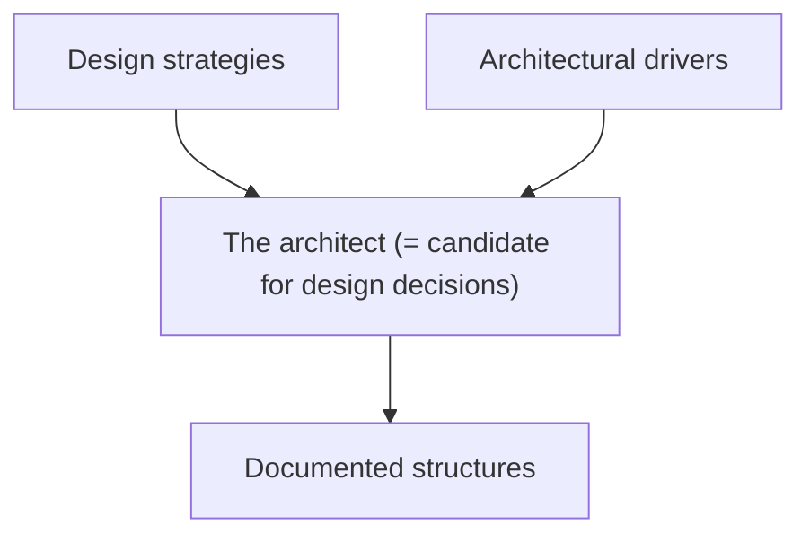

# SW Architecture Design

아키텍처 설계(architecture design)은 아키텍처 동인(architecture driver)를 찾아내면 바로 시작할 수 있다.

## What, who, why, when AD
- What
	- 구조적 FR, NFR 등을 만족하기 위한 요소들의 관계, styles, patterns
	- 목표: 모든 사용자들의 [[requirements capture|requirements]]와 성공적인 implementation을 만족하는 model을 만드는 것
- Who
	- SW architectures and designers: 여러 design strategies를 통해 복잡성을 분할 정복하며 requirements를 architecture design으로 바꾼다.
- Why
	- 시스템의 요구사항, 재사용성, 예측 가능한 행동, 수행 능력 등을 만족시켜야 한다.
	- SW 생산 중에 발생하는 risk를 방지한다.
	- 협업을 수월하게 만든다.
	- 시스템의 개발을 추적 가능하게 만든다.
	- 시스템에 높은 [[system qualities|QA]]를 유지시킬 수 있다.
- When
	- in SLDC(SW Life Cycle)
	- [[requirements capture|SW requirements analysis]]
	- [[SA design|SW design]] 초기
	- SW development & implementation
	- Testing, quality assurance, maintenance, evolution

## Intput & output
- Input: SRS(System requirement specification), analysis model
- Output: IEEE Std 1016-IEEE recommend practice for SDD(Software Design Descriptions)
	- Module, data, process과 그 사이의 의존성, 관계 등
	- 사용자 인터페이스(UI)
	- Detailed design(module and data)

## Architecture drivers
- 아키텍처로 구체화되는 기능/비기능 요구사항
- 모든 요구사항이 아키텍처로 구체화되는 것은 아니다.

- 선정 방법
	1. 가장 높은 우선순위를 가진 비즈니스 목표를 찾는다.
	2. 찾은 비즈니스 목표를 품질 시나리오나 use-case로 바꾼다.
	3. 아키텍처에 가장 많은 영향을 미치는 품질 시나리오나 use-case를 선택한다.

- Design purpose
- Quality attributes
- Primary functionality
- Architectural concerns
- Constraints

### Design purpose
- Stakeholders가 가장 걱정하는 business goal
- 프로젝트의 제안, 과정, 개발 도중의 설계, 도메인 등
- 아키텍처는 clear design goals와 clear design purpose를 정립해야 한다.

### Quality attributes
- 시스템의 Nonfunctional requirements
- System analyst는 본격적인 design process 전 완전한 QA list를 종합해야 한다.
- 측정 가능하고 테스트할 수 있어야 한다.
- Drivers 중 아키텍처의 모양을 결정하는 중요한 요소

- 예시
	- Efficiency
	- Functionality
	- Maintainability
	- Portability
	- Reliability
	- Usability

### Primary functionality
- Business goal을 이루기 위해 중요하다.
- 높은 기술적 어려움을 가진다.
- 아키텍처의 요소들 간의 상호작용을 요구한다.
- 주어진 use-case(혹은 user story)의 10%는 꼭 primary해야 한다.

- Functionality가 어떻게 요소에 반영될 지 미리 생각하고 계획해야 한다.
	- 자주 변하는 기능은 적은 요소들에게만 포함되어 있어 수정이 쉬워야 한다.
- QA scenario가 primary functionality에 직접적으로 연관이 있을 수 있다.

### Architectural concerns
- 표현은 안 되지만 고려되어야 하는 것
- 새 QA 시나리오의 도입을 야기할 수 있다.

- General concerns 예시: 아키텍처를 생성할 때의 이슈
	- 시스템 구조 전반
	- Functionality to modules 할당
	- Modules to teams 할당
	- 코드 베이스 구성
	- 프로젝트의 시작과 끝, 전달과 배포, 업데이트 등의 지원

- Specific concenrns 예시: 시스템 내부 이슈
	- 예외 처리
	- 의존성 관리
	- 형상 관리
	- Logging
	- 캐싱

- Internal requirements
- Past experiencec

### Constraints
- 아키텍처에 대해 선택권이 별로 없는 요소

- 예시
	- 규제를 받는 기술
	- 외부 시스템
	- 법적 요소
	- 개발자들의 역량
	- 협상 불가능한 마감 기한

## Architecture strategies
- Principle
- Tactic
- Style(pattern)
- Reference SW architectures(RA)
- External component
- Practical examples

### Principle
Flexibility와 reusability 향상

- [[SOLID|SOLID design principles]]
- [[GRASP|GRASP design principles]]
- Guidelines
	- Design process (순서 중요!)
		1. Think of what to do (analysis)
		2. Think of abstract design
		3. Think iterative refinements (tolerate refinements)
	- Architecture design
		- Think of early both FR and NFR
		- Think of reusability and extensibility
		- Avoid ambiguous or over-detailed design

### Tactic
- QA를 향상시키기 위한 Fundamental 설계 기술들
- 단일 QA의 조종에 초점을 맞춘다.
- Design 고려에 top-down 접근을 제시한다.

> [!example] Styles
> 여러 QA 등의 균형이나 해결에 초점을 맞추는 방법. Tactic은 style보다 더 단순하고 원시적이다.

### Style
검증된 SW 아키텍처
- 반복되는 문제를 해결하기 위한 SW 시스템의 기초적인 구조나 특성
- 특별한 기능을 하는 일련의 building blocks와 이들간의 순서, 관계

- 예시
	- Hierarchical architecture
	- Asynchronous communication architecture
	- Distributed architecture
	- Data flow architecture
	- Data-centered architecture

### RA
특정 도메인에서의 검증된 SW 아키텍처

- 예시
	- Web application RA
	- Rich client aaplications RA
	- Rich internet applications RA
	- Mobile applications RA
	- Service applications RA

> [!info] Reference architectures vs. architectural styles
> Architectural styles
> - 요소들의 타입, 관계, 순서 등을 표현한다.
> - 논리적, 물리적인 구조를 설계할 때 유용하다.
> 
> Reference architectures
> - 특별한 domain에서의 structure를 제공한다.
> - 여러 styles를 포함할 수 있다.

### External component
설계를 견고하게 하고 실제 구현에 가까워지도록
- 견고한 구현을 위해 tatic과 pattern 등을 이용하여 코드를 짜거나, 해당 기술을 갖고 올 수(살 수) 있다.

- Technology families: 공통된 기술적 목적에서의 특별한 기술들 e.g. RDBMS, ORM
- Product(SW package): 시스템에 통합될 수 있는 일부 기능을 가지는 SW e.g. Oracle, Microsoft SQL server
- Application frameworks: 보편적이고 반복적인 기이나 QA concerns를 해결할 수 있는 SW e.g. Spring framework
- Platforms: 애플리케이션이 빌드되고 실행되는 완전한 기반 e.g. Java, .Net, Google Cloud Platform