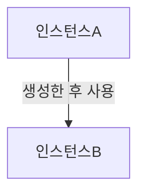
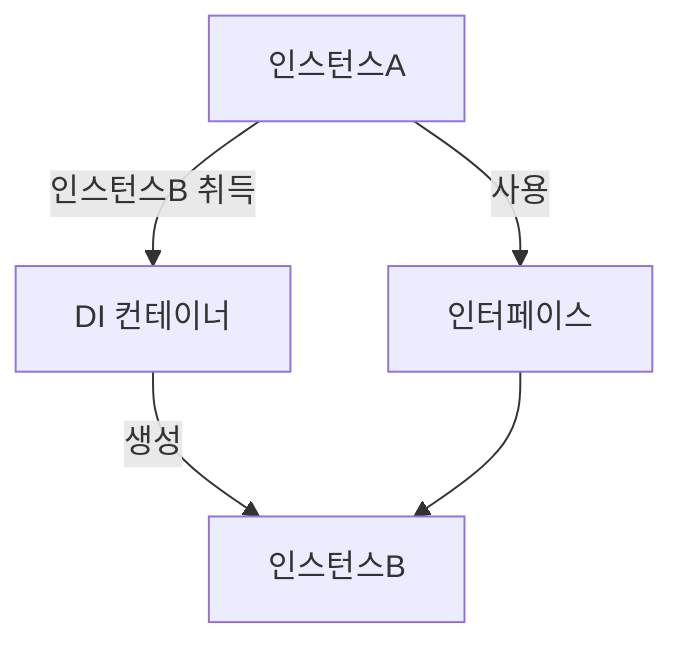
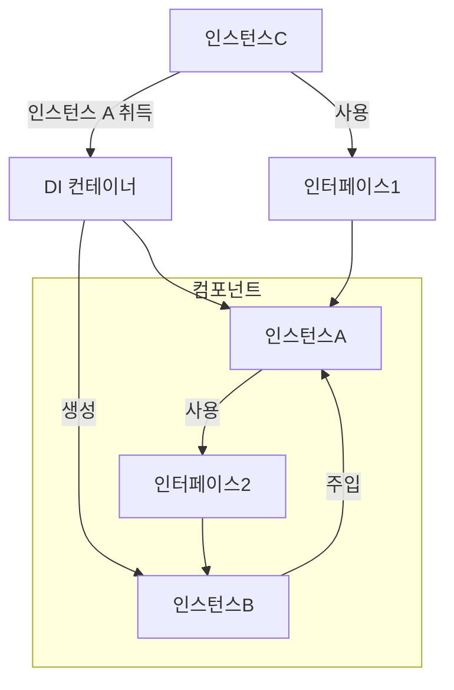

# Core of Spring Framework
- [[SOLID#SOLID OO design principles#DIP(Dependency Inversion Principle)|DI(Dependency Injection)]] Container를 가진다.

- 일반적인 애플리케이션에서의 의존 관계

- DI container를 활용한 인스턴스 생성

- DI container를 활용한 의존성 주입

