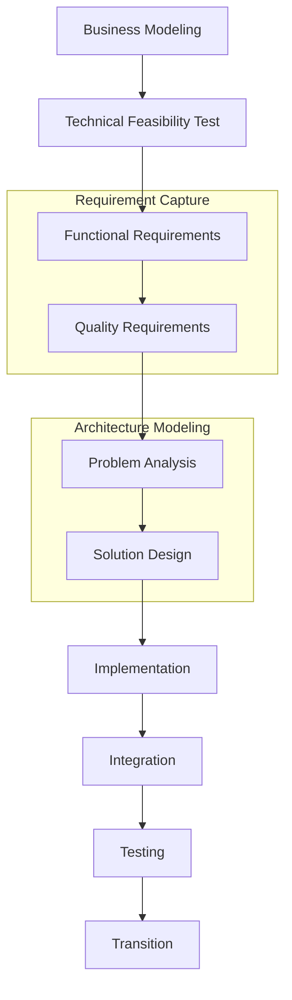
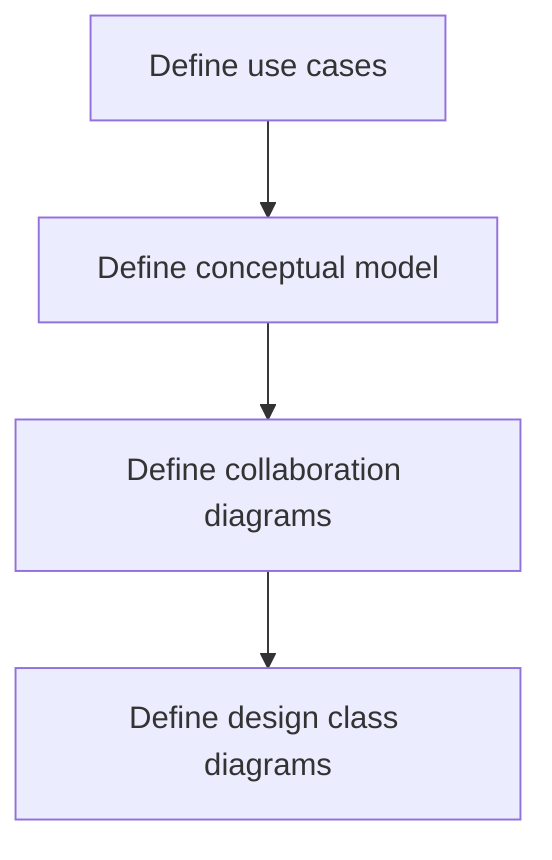

# SW Development Process

OO SW development process

## SW modeling & diagrams
| Step                           | Diagrams                                            | [[architecture views\|Architecture views]]                     |
| ------------------------------ | --------------------------------------------------- | --------------------------- |
| Business Modeling              | [[activity diagram\|Activity]]/[[info flow diagram\|Info Flow]] Diagram                          | Use-case view               |
| Requirements Capture           | [[use-case diagram\|Use-case Diagram]]                                    | Use-case view               |
| Problem Analysis               | [[class diagram\|Conceptual Model in Class Diagram]]                   | Logical & process view      |
| Logical Solution Design        | [[collaboration diagram\|Collaboration]]/[[sequence diagram\|Sequence]] Diagram, Class/State Diagram | Logical & process view      |
| Physical Implementation Design | [[component diagram\|Component]]/[[package diagram\|Package]]/[[model diagram\|Model]] Diagram, [[deployment diagram\|Deployment Diagram]] | Development & physical view |
