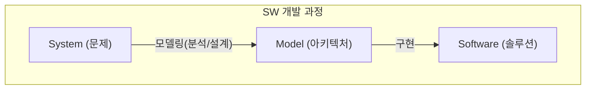

# Software Architecture
## SW 아키텍처
- IEEE 1471-2000 정의: fundamental organizational blueprint of a system
	- 시스템의 구성 요소와 그들 혹은 외부와의 관계를 일컫는다.
	- 또한 그것의 디자인과 발전을 위한 원리를 일컫는다.
	- 사용자와 이해관계자(stakeholders)의 functionality와 quality concern도 포함한다.

## SW 개발 과정

## SW modeling의 목적
- 상호작용에 대한 공통적인 이해를 목적으로 한다.
- 좋은 SW 시스템(기능과 품질)의 개발을 목적으로 한다.

## 아키텍처 모델링의 중요성
- 시스템이 만들어야 할 기능이 점차 복잡해지고 있다.
- 요구되는 소프트웨어 제품의 품질이 점차 높아지고 있다.

## [[architecture views|Architecture views]]
- Conceptual view
	- Logical view: end users를 위한 functionality 중심
	- Process view: system integrators를 위한 performance 중심
- Physical view
	- Implementation view: programmers를 위한 configuration management 중심
	- Deployment view: system engineers를 위한 system topology 중심
- Use-case view

## SW Modeling in [[UML diagram|UML]]
![[스크린샷 2023-10-26 오전 1.52.13.png]]