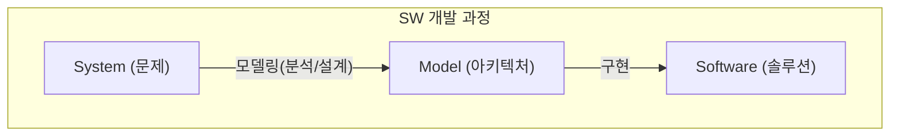

# Architecture Views
## 4+1 views
- Conceptual view
	- Logical view: end users를 위한 functionality 중심
	- Process view: system integrators를 위한 performance 중심
- Physical view
	- Implementation view: programmers를 위한 configuration management 중심
	- Deployment view: system engineers를 위한 system topology 중심
- Use-case view

### Use-case view
- Use-case diagram
### Logical view
- Collaboration diagram
- Sequence diagram
- Domain model class diagram
- Implementation model class diagram
- State machine diagram
### Process view
- Process flow diagram
### Implementation view
- Component diagram
- Package diagram
- Model diagram
### Deployment view
- Deployment diagram
## Architecture views in UML
- SW 개발 과정

### 1. Business modeling
- Activity/info flow diagram
### 2. Requirement capture
- Use-case diagram
### 3. Problem analysis
- Conceptual model in class diagram
### 4. Logical solution design
- Collaboration/sequence diagram
- Class diagram
- State diagram
### 5. Physical implementation design
- Component/package/model diagram
- Deployment diagram

## 정적 모델 vs. 동적 모델
- 정적 모델(구조적 다이어그램)
	- Class diagram
	- Component diagram
	- Package diagram
	- Deployment diagram
- 동적 모델(행동 다이어그램)
	- Use-case diagram
	- Activity diagram
	- Sequence diagram
	- Collaboration diagram